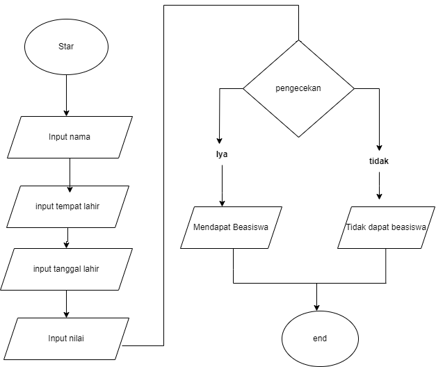

# Study kasus
Setiap tahunnya pemerintah memberikan bantuan beasiswa KIP yang di peruntukan bagi pelajar mulai dari tingkat sd,smp,sma bahkan sampai kuliah adapun bantuannya bervariasi sesuai kebutuhan tingkat sekolahnya.
tingkat tertinggi yaitu kuliah dimana beasiswa KIP ini diberikan dua kali selama 1 tahun dengan perhitungan dana yang diberikan akan cair pada semester ganjil dan genap, jadi mahasiswa akan diberi uang saku dan uang kuliah tiap semesternya, untuk uang saku akan langsung di kirimkan kepada penerima beasiswa lewat transfer bank dan untuk uang kuliah akan langsung dibayarkan ke Institut yang bersangkutan.

## adapun syarat-syarat bagi penerima beasiswa KIP mahasiswa sebagai berikut :
1. mahasiswa aktif
2. IPK min 3.0 tiap semesternya
3. umur max 25 tahun untuk jenjang s1
4. kehadiran 80% 
5. mengikuti kegiatan yang di agendakan oleh pemerintah setempat

## Langkah-langkah pendaftaran beasiswa KIP
1. masuk ke website beasiswa kip 2024
2. login
3. masukan nama,tempat lahir, tanggal lahir,alamat
4. masukan nilai masing mata kuliah sebanyak 10 MK
5. jika rata-rata IPK lebih dari 3.0 maka akan dinyatakan lulus
6. jika rata-rata IPK kurang dari 3.0 maka dinyatakan tidak lolos